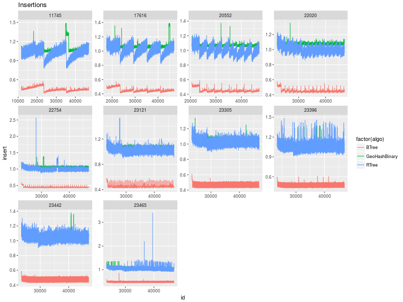

=================
Removal benchmark
=================

.. contents::

1 Design of Experiment
----------------------

PMA remove elements timely before doubling the array.
The array double only when :math:`\tau` \* PMA\_Capacity it reached. 

For several PMA sizes, how is the performance of the remove operation? 
Variables that may affect the remove performance:

- Amount of elements removed at each time: 

  - as a percentage of the total of elements in the data structure.

  - as an absolute value of elements removed.

- Size of the data structure: because before each removal we need to scan the storage array.

1.1 Computation of PMA Capacity
~~~~~~~~~~~~~~~~~~~~~~~~~~~~~~~

Pma Capacity is computed based on the desired number of elements to store and the :math:`\tau` parameter:

.. code:: python
    :name: PmaCap

    import math as m
    def tauInit(n,th):
        s = n / th / 8
        seg = 2**(m.ceil(m.log2(s)))
        return seg*8

    print( tauInit(n,th))

::

    2048

1.2 Computation of size and frequency of remove operations
~~~~~~~~~~~~~~~~~~~~~~~~~~~~~~~~~~~~~~~~~~~~~~~~~~~~~~~~~~

Time window size
    a lower bound on the amount of *Batches* we will keep in-memory 

Batch size
    the number of elements inserted in each batch

EMin
    the lower bound of the amount of *elements* kept in memory ( time window × batch size ).

PMA Size
    The capacity of the PMA computed to store *EMin* elements given a :math:`\tau` value of *0.7*

Tau Size
    The amount of elements at which the given PMA will be required to remove elements. ( PMA Size × :math:`\tau`)

.. table:: Example

    +------------------+-------+-------+----------+----------+----------+------------------------+------+----------------------+------------+
    | Time Window Size | Batch |  EMin | PMA Size | Rho Size | Tau Size | First removal at batch | #del | Interval (# Batches) |       rm % |
    +==================+=======+=======+==========+==========+==========+========================+======+======================+============+
    |               15 |  1000 | 15000 |    32768 |    10000 |    22000 |                     22 | 8000 |                    8 | 0.36363636 |
    +------------------+-------+-------+----------+----------+----------+------------------------+------+----------------------+------------+

We first will test , for a fixed PMA Size, how the percentage of removals affects the performance.

We choose a target Emin = 21600000 and compute the resulting PMA Capacity:
PmaCap(n=21600000,th=0.7) = *33554432*. 

This will result in the following setup: 

.. table::

    +------------------+-------+----------+----------+----------+----------+------------------------+---------+----------------------+-------------+
    | Time Window Size | Batch |     EMin | PMA Size | Rho Size | Tau Size | First removal at batch |    #del | Interval (# Batches) |        rm % |
    +==================+=======+==========+==========+==========+==========+========================+=========+======================+=============+
    |            21600 |  1000 | 21600000 | 33554432 | 10067000 | 23488000 |                  23488 | 1889000 |                 1889 | 0.080424046 |
    +------------------+-------+----------+----------+----------+----------+------------------------+---------+----------------------+-------------+

The minimum *EMin* value that result in a PMA Size of *33554432* is :math:`\frac{PMA\_SIZE}{2}+1` = *11744052.2* . 
Example: 

- tauInit(n=11744052,th=0.7) =  *33554432*

- tauInit(n=11744051,th=0.7) =  *16777216*

The maximum *EMin* value with the this same size is equal to :math:`PMA\_SIZE \times \tau_h` = *23488102.4* ( when :math:`\tau`\ :sub:`h`\ is *0.7* ) .

We generate several window sizes to test with the allow boundaries of chosen PMA size.

.. code:: python

    import math as m
    batch = 1000
    minWs = m.ceil(11744052 / batch)
    maxWs = m.floor(23488102.4 / batch)

    # Possible variation of window size.
    diff = maxWs - minWs;

    # Increase the window size logarithmicly from minWs to MaxWs
    wSizes = [ round(maxWs - diff/2**i) for i in range(0,10) ]
    print( wSizes )
    #print ("| Window Size",*wSizes,sep="|\n| ")

    #wSizes = [ round(minWs + diff/2**i) for i in range(0,10) ]
    #print (wSizes)

::

    [11745, 17616, 20552, 22020, 22754, 23121, 23305, 23396, 23442, 23465]

.. table:: Experiment variables
    :name: tbl:ExpVariables

    +------------------+-------+----------+----------+----------+----------+------------------------+----------+----------------------+--------------+
    | Time Window Size | Batch |     EMin | PMA Size | Rho Size | Tau Size | First removal at batch |     #del | Interval (# Batches) |         rm % |
    +==================+=======+==========+==========+==========+==========+========================+==========+======================+==============+
    |            11745 |  1000 | 11745000 | 33554432 | 10067000 | 23488000 |                  23488 | 11744000 |                11744 |          0.5 |
    +------------------+-------+----------+----------+----------+----------+------------------------+----------+----------------------+--------------+
    |            17616 |  1000 | 17616000 | 33554432 | 10067000 | 23488000 |                  23488 |  5873000 |                 5873 |   0.25004257 |
    +------------------+-------+----------+----------+----------+----------+------------------------+----------+----------------------+--------------+
    |            20552 |  1000 | 20552000 | 33554432 | 10067000 | 23488000 |                  23488 |  2937000 |                 2937 |   0.12504257 |
    +------------------+-------+----------+----------+----------+----------+------------------------+----------+----------------------+--------------+
    |            22020 |  1000 | 22020000 | 33554432 | 10067000 | 23488000 |                  23488 |  1469000 |                 1469 |  0.062542575 |
    +------------------+-------+----------+----------+----------+----------+------------------------+----------+----------------------+--------------+
    |            22754 |  1000 | 22754000 | 33554432 | 10067000 | 23488000 |                  23488 |   735000 |                  735 |  0.031292575 |
    +------------------+-------+----------+----------+----------+----------+------------------------+----------+----------------------+--------------+
    |            23121 |  1000 | 23121000 | 33554432 | 10067000 | 23488000 |                  23488 |   368000 |                  368 |  0.015667575 |
    +------------------+-------+----------+----------+----------+----------+------------------------+----------+----------------------+--------------+
    |            23305 |  1000 | 23305000 | 33554432 | 10067000 | 23488000 |                  23488 |   184000 |                  184 | 7.8337875e-3 |
    +------------------+-------+----------+----------+----------+----------+------------------------+----------+----------------------+--------------+
    |            23396 |  1000 | 23396000 | 33554432 | 10067000 | 23488000 |                  23488 |    93000 |                   93 | 3.9594687e-3 |
    +------------------+-------+----------+----------+----------+----------+------------------------+----------+----------------------+--------------+
    |            23442 |  1000 | 23442000 | 33554432 | 10067000 | 23488000 |                  23488 |    47000 |                   47 | 2.0010218e-3 |
    +------------------+-------+----------+----------+----------+----------+------------------------+----------+----------------------+--------------+
    |            23465 |  1000 | 23465000 | 33554432 | 10067000 | 23488000 |                  23488 |    24000 |                   24 | 1.0217984e-3 |
    +------------------+-------+----------+----------+----------+----------+------------------------+----------+----------------------+--------------+

.. _execParameters:

1.3 Parameters for RTree and Btree
~~~~~~~~~~~~~~~~~~~~~~~~~~~~~~~~~~

To compare the BTree / TREE with the PMQ we will define a MAXSIZE that these data structure can have.
This way we afford some slack to perform the removals. 

We set the max size equal to the max number of elements that the PMA can host ( *Tau Size* ). 
At each removal all the elements inserted more *T* Batches in the past are deleted. 

.. table::

    +----------------------------+-------+---------------------------+----------+---------------+-----------------------------+
    | Time Window Size (Batches) | Batch | n elts (min elts in tree) | PMA Size | % of Tau Size | Tau Size (Max elts in tree) |
    +============================+=======+===========================+==========+===============+=============================+
    |                      11745 |  1000 |                  11745000 | 33554432 |    0.50004257 |                    23488000 |
    +----------------------------+-------+---------------------------+----------+---------------+-----------------------------+
    |                      17616 |  1000 |                  17616000 | 33554432 |          0.75 |                    23488000 |
    +----------------------------+-------+---------------------------+----------+---------------+-----------------------------+
    |                      20552 |  1000 |                  20552000 | 33554432 |         0.875 |                    23488000 |
    +----------------------------+-------+---------------------------+----------+---------------+-----------------------------+
    |                      22020 |  1000 |                  22020000 | 33554432 |        0.9375 |                    23488000 |
    +----------------------------+-------+---------------------------+----------+---------------+-----------------------------+
    |                      22754 |  1000 |                  22754000 | 33554432 |       0.96875 |                    23488000 |
    +----------------------------+-------+---------------------------+----------+---------------+-----------------------------+
    |                      23121 |  1000 |                  23121000 | 33554432 |      0.984375 |                    23488000 |
    +----------------------------+-------+---------------------------+----------+---------------+-----------------------------+
    |                      23305 |  1000 |                  23305000 | 33554432 |    0.99220879 |                    23488000 |
    +----------------------------+-------+---------------------------+----------+---------------+-----------------------------+
    |                      23396 |  1000 |                  23396000 | 33554432 |    0.99608311 |                    23488000 |
    +----------------------------+-------+---------------------------+----------+---------------+-----------------------------+
    |                      23442 |  1000 |                  23442000 | 33554432 |    0.99804155 |                    23488000 |
    +----------------------------+-------+---------------------------+----------+---------------+-----------------------------+
    |                      23465 |  1000 |                  23465000 | 33554432 |    0.99902078 |                    23488000 |
    +----------------------------+-------+---------------------------+----------+---------------+-----------------------------+

1.4 Execution parameters
~~~~~~~~~~~~~~~~~~~~~~~~

.. table::
    :name: execParam

    +------------------+-------+----------+----------------------+
    | Time Window Size | Batch |    tSize | Results in removal % |
    +==================+=======+==========+======================+
    |            11745 |  1000 | 23488000 |                  0.5 |
    +------------------+-------+----------+----------------------+
    |            17616 |  1000 | 23488000 |           0.25004257 |
    +------------------+-------+----------+----------------------+
    |            20552 |  1000 | 23488000 |           0.12504257 |
    +------------------+-------+----------+----------------------+
    |            22020 |  1000 | 23488000 |          0.062542575 |
    +------------------+-------+----------+----------------------+
    |            22754 |  1000 | 23488000 |          0.031292575 |
    +------------------+-------+----------+----------------------+
    |            23121 |  1000 | 23488000 |          0.015667575 |
    +------------------+-------+----------+----------------------+
    |            23305 |  1000 | 23488000 |         7.8337875e-3 |
    +------------------+-------+----------+----------------------+
    |            23396 |  1000 | 23488000 |         3.9594687e-3 |
    +------------------+-------+----------+----------------------+
    |            23442 |  1000 | 23488000 |         2.0010218e-3 |
    +------------------+-------+----------+----------------------+
    |            23465 |  1000 | 23488000 |         1.0217984e-3 |
    +------------------+-------+----------+----------------------+

We will run the experiment inserting *46976000* elements.
The measured times are reported in terms of % of Removals:

.. table::

    +--------------+-------------------+------------------------+
    | % of elts RM | Time of the RM OP | Avg time of the Period |
    +==============+===================+========================+
    |        0.500 | \                 | \                      |
    +--------------+-------------------+------------------------+
    |        0.250 | \                 | \                      |
    +--------------+-------------------+------------------------+
    |        0.125 | \                 | \                      |
    +--------------+-------------------+------------------------+
    |        0.063 | \                 | \                      |
    +--------------+-------------------+------------------------+
    |        0.031 | \                 | \                      |
    +--------------+-------------------+------------------------+
    |        0.016 | \                 | \                      |
    +--------------+-------------------+------------------------+
    |        0.008 | \                 | \                      |
    +--------------+-------------------+------------------------+
    |        0.004 | \                 | \                      |
    +--------------+-------------------+------------------------+
    |        0.002 | \                 | \                      |
    +--------------+-------------------+------------------------+
    |        0.001 | \                 | \                      |
    +--------------+-------------------+------------------------+

2 Analysis
----------

2.1 Results
~~~~~~~~~~~

2.1.1 Summary Tables of Remove Times
^^^^^^^^^^^^^^^^^^^^^^^^^^^^^^^^^^^^

.. code:: R

    df %>% filter(!is.na(remove)) %>%
        mutate(remove = as.numeric(remove)) %>%
        group_by(algo,T) %>%
        summarize(RemoveTime = signif(mean(remove)), stdv = signif(sd(remove))) %>%
        arrange(T,algo)

.. table::

    +---------------+-------+------------+---------+
    | algo          |     T | RemoveTime |    stdv |
    +===============+=======+============+=========+
    | BTree         | 11745 |    2938.56 | 31.9188 |
    +---------------+-------+------------+---------+
    | GeoHashBinary | 11745 |    719.014 | 134.508 |
    +---------------+-------+------------+---------+
    | RTree         | 11745 |      10268 | 345.705 |
    +---------------+-------+------------+---------+
    | BTree         | 17616 |    1897.55 | 15.5949 |
    +---------------+-------+------------+---------+
    | GeoHashBinary | 17616 |    633.379 | 12.9222 |
    +---------------+-------+------------+---------+
    | RTree         | 17616 |    6008.85 | 230.542 |
    +---------------+-------+------------+---------+
    | BTree         | 20552 |    1316.32 | 21.9188 |
    +---------------+-------+------------+---------+
    | GeoHashBinary | 20552 |    617.114 | 10.5823 |
    +---------------+-------+------------+---------+
    | RTree         | 20552 |    3569.99 | 85.4322 |
    +---------------+-------+------------+---------+
    | BTree         | 22020 |    970.417 | 17.2736 |
    +---------------+-------+------------+---------+
    | GeoHashBinary | 22020 |    616.018 | 7.95398 |
    +---------------+-------+------------+---------+
    | RTree         | 22020 |    2223.55 |  69.507 |
    +---------------+-------+------------+---------+
    | BTree         | 22754 |    760.748 | 10.4232 |
    +---------------+-------+------------+---------+
    | GeoHashBinary | 22754 |    604.105 | 5.68478 |
    +---------------+-------+------------+---------+
    | RTree         | 22754 |    1393.05 | 41.2335 |
    +---------------+-------+------------+---------+
    | BTree         | 23121 |    649.198 | 8.72301 |
    +---------------+-------+------------+---------+
    | GeoHashBinary | 23121 |    556.607 | 4.00548 |
    +---------------+-------+------------+---------+
    | RTree         | 23121 |    960.784 | 28.5292 |
    +---------------+-------+------------+---------+
    | BTree         | 23305 |    588.715 | 8.76007 |
    +---------------+-------+------------+---------+
    | GeoHashBinary | 23305 |    558.013 | 2.78677 |
    +---------------+-------+------------+---------+
    | RTree         | 23305 |    690.343 |   18.71 |
    +---------------+-------+------------+---------+
    | BTree         | 23396 |    563.927 | 14.1947 |
    +---------------+-------+------------+---------+
    | GeoHashBinary | 23396 |    562.311 | 8.97959 |
    +---------------+-------+------------+---------+
    | RTree         | 23396 |    568.807 | 25.1274 |
    +---------------+-------+------------+---------+
    | BTree         | 23442 |    535.037 | 8.12749 |
    +---------------+-------+------------+---------+
    | GeoHashBinary | 23442 |    560.956 | 13.4803 |
    +---------------+-------+------------+---------+
    | RTree         | 23442 |    491.738 | 10.9601 |
    +---------------+-------+------------+---------+
    | BTree         | 23465 |    525.734 | 8.05529 |
    +---------------+-------+------------+---------+
    | GeoHashBinary | 23465 |    564.266 | 10.6004 |
    +---------------+-------+------------+---------+
    | RTree         | 23465 |     441.24 | 22.8475 |
    +---------------+-------+------------+---------+

2.1.2 Overview of results
^^^^^^^^^^^^^^^^^^^^^^^^^

Plot an overview of every benchmark , doing average of times. 

.. code:: R

    df %>% filter(!is.na(remove)) %>% 
        mutate(remove=as.numeric(remove)) %>%
        mutate(remove=ifelse(algo != "GeoHashBinary", remove + insert, remove)) %>% # Remove actually accounts for remove + a small insertion 
        group_by(algo,T) %>%
        summarize(RemoveTime = mean(remove), RemoveSum = sum(remove), stdv = sd(remove)) %>%
        mutate(T = as.factor(T))-> dfplot

    dfplot

.. code:: R

    library(ggplot2)

    dfplot %>%
    #    filter(algo == "GeoHashBinary") %>%
        ggplot( aes(x=T,y=RemoveTime, fill=factor(algo))) + 
        geom_bar(stat="identity", position="dodge")+
        geom_errorbar( position=position_dodge(0.9), 
                       aes(ymin = RemoveTime - stdv, ymax = RemoveTime + stdv), width=0.5)+
        labs(title = "Average time of removal operations") 

.. image:: ./img/overview.png

The average remove time decreases logarithmicly for BTree and Rtree. 
However for the PMQ the time seems much more stable no matter the amount of removals. 

2.1.3 Insertion performance
^^^^^^^^^^^^^^^^^^^^^^^^^^^

.. code:: R

    df %>% filter(is.na(remove)) %>%  # get only lines with no removes
           mutate(remove=as.numeric(remove)) %>%
           mutate(T = as.factor(T))-> dfinsert

    dfinsert

2.1.3.1 Overall
:::::::::::::::

.. code:: R

    dfinsert %>%
    ggplot(aes(x=id,y=insert, color=factor(algo))) + 
    geom_line() +
    labs(title = "Insertions") + 
    facet_wrap(~T, scales="free")

2.1.3.1.1 Total insertion time (without the removals) :
'''''''''''''''''''''''''''''''''''''''''''''''''''''''

.. code:: R

    dfinsert %>% 
        group_by(algo, T) %>%
        summarize(Average = signif(mean(insert)), Stdv = signif(sd(insert)), Total = signif(sum(insert))) %>%
    arrange(T,algo)

.. table::

    +---------------+-------+----------+------------+---------+
    | algo          |     T |  Average |       Stdv |   Total |
    +===============+=======+==========+============+=========+
    | BTree         | 11745 | 0.448848 |  0.0293204 | 15812.5 |
    +---------------+-------+----------+------------+---------+
    | GeoHashBinary | 11745 |  1.09319 |  0.0628743 | 38512.1 |
    +---------------+-------+----------+------------+---------+
    | RTree         | 11745 |  1.01856 |  0.0746711 | 35882.8 |
    +---------------+-------+----------+------------+---------+
    | BTree         | 17616 | 0.451324 |  0.0268541 | 13249.1 |
    +---------------+-------+----------+------------+---------+
    | GeoHashBinary | 17616 |  1.08116 |  0.0407717 | 31738.5 |
    +---------------+-------+----------+------------+---------+
    | RTree         | 17616 |  1.01504 |  0.0658717 | 29797.5 |
    +---------------+-------+----------+------------+---------+
    | BTree         | 20552 | 0.448744 |  0.0240568 |   11854 |
    +---------------+-------+----------+------------+---------+
    | GeoHashBinary | 20552 |  1.07296 |  0.0117558 | 28343.3 |
    +---------------+-------+----------+------------+---------+
    | RTree         | 20552 |  1.00105 |  0.0582154 | 26443.7 |
    +---------------+-------+----------+------------+---------+
    | BTree         | 22020 | 0.447691 |  0.0193614 | 11165.4 |
    +---------------+-------+----------+------------+---------+
    | GeoHashBinary | 22020 |  1.07911 | 0.00986746 | 26913.1 |
    +---------------+-------+----------+------------+---------+
    | RTree         | 22020 |  1.00231 |  0.0462575 | 24997.5 |
    +---------------+-------+----------+------------+---------+
    | BTree         | 22754 | 0.440994 |  0.0164774 | 10667.7 |
    +---------------+-------+----------+------------+---------+
    | GeoHashBinary | 22754 |  1.07052 |  0.0297494 | 25895.8 |
    +---------------+-------+----------+------------+---------+
    | RTree         | 22754 |  1.00679 |  0.0544763 | 24354.3 |
    +---------------+-------+----------+------------+---------+
    | BTree         | 23121 | 0.445606 |  0.0155989 | 10601.4 |
    +---------------+-------+----------+------------+---------+
    | GeoHashBinary | 23121 |  1.06871 | 0.00692898 | 25425.7 |
    +---------------+-------+----------+------------+---------+
    | RTree         | 23121 |  1.02198 |  0.0449252 | 24313.9 |
    +---------------+-------+----------+------------+---------+
    | BTree         | 23305 | 0.443706 |  0.0145924 | 10446.2 |
    +---------------+-------+----------+------------+---------+
    | GeoHashBinary | 23305 |  1.06769 | 0.00791834 | 25136.6 |
    +---------------+-------+----------+------------+---------+
    | RTree         | 23305 |  1.02155 |  0.0360618 | 24050.3 |
    +---------------+-------+----------+------------+---------+
    | BTree         | 23396 | 0.452135 |  0.0186625 |   10547 |
    +---------------+-------+----------+------------+---------+
    | GeoHashBinary | 23396 |  1.08239 |  0.0299922 |   25249 |
    +---------------+-------+----------+------------+---------+
    | RTree         | 23396 |  1.06218 |  0.0817903 | 24777.4 |
    +---------------+-------+----------+------------+---------+
    | BTree         | 23442 | 0.457403 |  0.0168122 | 10535.8 |
    +---------------+-------+----------+------------+---------+
    | GeoHashBinary | 23442 |  1.07103 |  0.0219033 |   24670 |
    +---------------+-------+----------+------------+---------+
    | RTree         | 23442 |  1.03593 |  0.0410284 | 23861.6 |
    +---------------+-------+----------+------------+---------+
    | BTree         | 23465 | 0.472946 |  0.0166012 | 10656.4 |
    +---------------+-------+----------+------------+---------+
    | GeoHashBinary | 23465 |  1.07213 |  0.0241641 | 24157.3 |
    +---------------+-------+----------+------------+---------+
    | RTree         | 23465 |  1.05569 |  0.0745693 | 23786.8 |
    +---------------+-------+----------+------------+---------+

.. code:: R

    library(ggplot2)

    dfinsert %>% 
        group_by(algo, T) %>%
        summarize(avg = mean(insert), stdv = sd(insert)) %>%
        ggplot( aes(x=T,y=avg, fill=factor(algo))) + 
        geom_bar(stat="identity", position="dodge")+
        geom_errorbar( position=position_dodge(0.9), 
                       aes(ymin = avg - stdv, ymax = avg + stdv), width=0.5) +
        #facet_wrap(~T, scale="free_x")+ 
        labs(title = "Average Insertions (without removals)") 

.. image:: ./img/averageInsOnly.png

In average the insertions are 2X faster with standard Btrees. 
PMQ and Rtree are not statistically different in general (except maybe on T=20552). 

This means that the insertion time doesn't change with T.
No matter the parameter T choosed, the insertions take the same time.

2.1.3.1.2 Total benchmark time with the removals:
'''''''''''''''''''''''''''''''''''''''''''''''''

.. code:: R

    options(digits=6)
    df %>% 
        mutate(remove = if_else(is.na(remove), 0 , as.numeric(remove))) %>%
        mutate(ins_rm=if_else(algo == "GeoHashBinary", insert, as.numeric(remove) + insert)) %>% 
        group_by(algo,T) %>%
        summarize(AvgTime = signif(mean(ins_rm)), stdv = signif(sd(ins_rm)), total = signif(sum(ins_rm))) %>%
        mutate(T = as.factor(T))-> dfTotals

    dfTotals %>% arrange(T,algo)

.. table::

    +---------------+-------+----------+---------+---------+
    | algo          |     T |  AvgTime |    stdv |   total |
    +===============+=======+==========+=========+=========+
    | BTree         | 11745 | 0.615667 | 22.1411 | 21690.6 |
    +---------------+-------+----------+---------+---------+
    | GeoHashBinary | 11745 |  1.13395 |  5.4567 | 39950.2 |
    +---------------+-------+----------+---------+---------+
    | RTree         | 11745 |  1.60146 | 77.3851 | 56420.9 |
    +---------------+-------+----------+---------+---------+
    | BTree         | 17616 | 0.709849 | 22.1483 | 20841.2 |
    +---------------+-------+----------+---------+---------+
    | GeoHashBinary | 17616 |   1.1673 | 7.38119 |   34272 |
    +---------------+-------+----------+---------+---------+
    | RTree         | 17616 |  1.83369 | 70.1725 | 53837.3 |
    +---------------+-------+----------+---------+---------+
    | BTree         | 20552 | 0.847273 | 22.9039 | 22388.3 |
    +---------------+-------+----------+---------+---------+
    | GeoHashBinary | 20552 |  1.25947 |  10.719 | 33280.2 |
    +---------------+-------+----------+---------+---------+
    | RTree         | 20552 |   2.0819 | 62.1257 | 55012.1 |
    +---------------+-------+----------+---------+---------+
    | BTree         | 22020 |  1.06986 | 24.5679 | 26699.4 |
    +---------------+-------+----------+---------+---------+
    | GeoHashBinary | 22020 |  1.47337 | 15.5671 | 36769.4 |
    +---------------+-------+----------+---------+---------+
    | RTree         | 22020 |  2.42791 | 56.3111 | 60590.8 |
    +---------------+-------+----------+---------+---------+
    | BTree         | 22754 |  1.44603 | 27.6358 | 35025.7 |
    +---------------+-------+----------+---------+---------+
    | GeoHashBinary | 22754 |  1.86719 | 21.9055 | 45227.1 |
    +---------------+-------+----------+---------+---------+
    | RTree         | 22754 |   2.8472 | 50.6234 |   68965 |
    +---------------+-------+----------+---------+---------+
    | BTree         | 23121 |  2.18732 | 33.5847 | 52178.5 |
    +---------------+-------+----------+---------+---------+
    | GeoHashBinary | 23121 |  2.55915 | 28.7376 | 61048.6 |
    +---------------+-------+----------+---------+---------+
    | RTree         | 23121 |  3.59963 | 49.7209 | 85869.3 |
    +---------------+-------+----------+---------+---------+
    | BTree         | 23305 |  3.62714 | 43.1796 | 85858.1 |
    +---------------+-------+----------+---------+---------+
    | GeoHashBinary | 23305 |  4.07935 | 40.8457 | 96562.3 |
    +---------------+-------+----------+---------+---------+
    | RTree         | 23305 |  4.75458 | 50.6472 |  112546 |
    +---------------+-------+----------+---------+---------+
    | BTree         | 23396 |  6.50265 | 58.1178 |  153332 |
    +---------------+-------+----------+---------+---------+
    | GeoHashBinary | 23396 |  7.10406 | 57.8297 |  167514 |
    +---------------+-------+----------+---------+---------+
    | RTree         | 23396 |  7.16493 | 58.6585 |  168949 |
    +---------------+-------+----------+---------+---------+
    | BTree         | 23442 |  11.8244 | 77.1621 |  278274 |
    +---------------+-------+----------+---------+---------+
    | GeoHashBinary | 23442 |  12.9663 | 80.7626 |  305148 |
    +---------------+-------+----------+---------+---------+
    | RTree         | 23442 |  11.4832 | 70.9287 |  270246 |
    +---------------+-------+----------+---------+---------+
    | BTree         | 23465 |  22.3638 | 105.035 |  525795 |
    +---------------+-------+----------+---------+---------+
    | GeoHashBinary | 23465 |  24.5236 |  112.53 |  576573 |
    +---------------+-------+----------+---------+---------+
    | RTree         | 23465 |  19.4282 | 88.2658 |  456776 |
    +---------------+-------+----------+---------+---------+

.. code:: R

    df %>% 
        mutate(remove = if_else(is.na(remove), 0 , as.numeric(remove))) %>%
        mutate(ins_rm=if_else(algo == "GeoHashBinary", insert, as.numeric(remove) + insert)) %>% 
        group_by(algo,T) %>%
        summarize(total = sum(ins_rm) , avg = mean(ins_rm), std= sd(ins_rm)) %>%
        mutate(T = as.factor(T)) -> totalPlot
    totalPlot

.. code:: R

    library(ggplot2)

    totalPlot %>%
        ggplot( aes(x=T,y=total, fill=factor(algo))) + 
        geom_bar(stat="identity", position="dodge")+
        labs(title = "Total sum of Insertions and Removals") 

.. image:: ./img/totalInsRm.png

The total insertion time increased with parameter T. 
Because with a lager T (closer to the limit 23488) as show in `tbl:ExpVariables`_, the frequency of expensive remotions increases. 
The best value of T is lower than 22754 for every algorithm. 

2.1.3.1.3 Average benchmark time with the removals:
'''''''''''''''''''''''''''''''''''''''''''''''''''

Bimodal behaviour, it doesn't make sense to do an average of removals together with insertions. 

.. code:: R

    library(ggplot2)

    totalPlot %>%
        ggplot( aes(x=T,y=avg, fill=factor(algo))) + 
        geom_bar(stat="identity", position="dodge")+
        geom_errorbar( position=position_dodge(0.9), 
                       aes(ymin = avg - std, ymax = avg + std), width=0.5) +
        labs(title = "Average Insertions and Removals") 

2.1.4 Conclusion
^^^^^^^^^^^^^^^^

We need to find a tradeoff between these two plots: 

.. image:: ./img/totalInsRm.png
.. image:: ./img/overview.png

Best T value for optimal Remove Time:

.. table::

    +---------------+-------+---------------------+-----------+
    | algo          |     T | RemoveTime avg (ms) |      stdv |
    +===============+=======+=====================+===========+
    | BTree         | 23465 |          526.188970 |  8.053197 |
    +---------------+-------+---------------------+-----------+
    | GeoHashBinary | 23121 |          556.606700 |  4.005477 |
    +---------------+-------+---------------------+-----------+
    | RTree         | 23465 |          442.277040 | 22.851265 |
    +---------------+-------+---------------------+-----------+

Best T value for optimal total execution time:

.. table::

    +---------------+-------+--------------+----------+-----------+
    | algo          |     T |     sum (ms) | avg (ms) |       std |
    +===============+=======+==============+==========+===========+
    | BTree         | 17616 | 20841.163000 | 0.709849 | 22.148266 |
    +---------------+-------+--------------+----------+-----------+
    | GeoHashBinary | 20552 | 33280.174000 | 1.259468 | 10.718993 |
    +---------------+-------+--------------+----------+-----------+
    | RTree         | 17616 | 53837.282000 | 1.833695 | 70.172511 |
    +---------------+-------+--------------+----------+-----------+

Compute a tradeoff between total running time and time spent on removals. 

.. code:: R

    library(ggplot2)
    require(grid)

    inner_join(dfplot,totalPlot) %>% 
    #mutate ( ratio = (sqrt(RemoveTime * total))) %>%
    #mutate ( ratio = sqrt(RemoveSum * total)) %>%
    mutate ( ratio = (sqrt(RemoveTime * avg))) %>%
        ggplot( aes(x=T,y=ratio, fill=factor(algo))) + 
        geom_bar(stat="identity", position="dodge") + 
        annotate(geom = "text",x = unique(dfplot$T), y = 132,
                 #label = (23488 - unique(as.numeric(as.character(dfplot$T)))), size = 4) + # size of the removal 
                 label = paste( round((23488 - unique(as.numeric(as.character(dfplot$T))))/23488 * 100,2), "%"), size = 4) + # percentage remove from the max allowed. 
        annotate(geom = "text",x = unique(dfplot$T), y = 140,
                 label = paste( round((23488 - unique(as.numeric(as.character(dfplot$T))))/ unique(as.numeric(as.character(dfplot$T))) * 100,2), "%"), size = 4) + # perecentage of overflow relative to the min elements required.
        labs(x = "T", 
             y = "sqrt(Avg Remove Time X Avg total running time)  ms",
             title="% of overflow allowed relative to T \n% of removed elements relative to the max (23.488.000 elements)"
             )-> p

    p

Best T Values based on relation ( Avg Remove time × Avg running time): 

.. code:: R

    inner_join(dfplot,totalPlot) %>% 
    mutate ( ratio = sqrt(RemoveTime * avg)) %>%
    group_by(algo) %>% 
    top_n(-1,ratio) -> tmp
    names(tmp) = c("algo","T","Rm Time Avg","Rm Time Sum","Rm  stdv","Total Time sum","Total Time Avg","Total stdv","ratio")
    
    tmp

.. table::

    +---------------+-------+-------------+-------------+----------+----------------+----------------+------------+--------+
    | algo          |     T | Rm Time Avg | Rm Time Sum | Rm  stdv | Total Time sum | Total Time Avg | Total stdv |  ratio |
    +===============+=======+=============+=============+==========+================+================+============+========+
    | BTree         | 22020 |     970.873 |   15533.975 |   17.256 |      26699.386 |          1.070 |     24.568 | 32.229 |
    +---------------+-------+-------------+-------------+----------+----------------+----------------+------------+--------+
    | GeoHashBinary | 17616 |     633.379 |    2533.517 |   12.922 |      34272.027 |          1.167 |      7.381 | 27.191 |
    +---------------+-------+-------------+-------------+----------+----------------+----------------+------------+--------+
    | RTree         | 23305 |     691.369 |   88495.277 |   18.703 |     112545.550 |          4.755 |     50.647 | 57.334 |
    +---------------+-------+-------------+-------------+----------+----------------+----------------+------------+--------+

2.1.5 Next tests
^^^^^^^^^^^^^^^^

We will have to run this benchmark again using the optimal T parameter for the PMQ (17616) and configuring the optimal removal frequency / size for the Rtree and the Btree.

.. table::

    +-------+-----------------------+
    | \     | optimal % of overflow |
    +=======+=======================+
    | BTree |                 6.67% |
    +-------+-----------------------+
    | RTree |                 0.79% |
    +-------+-----------------------+
    | PMQ   |                33.33% |
    +-------+-----------------------+
