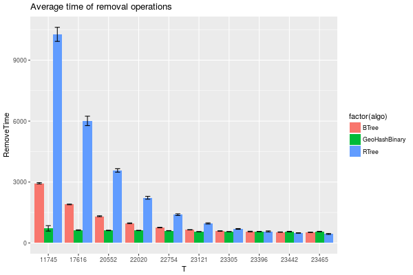
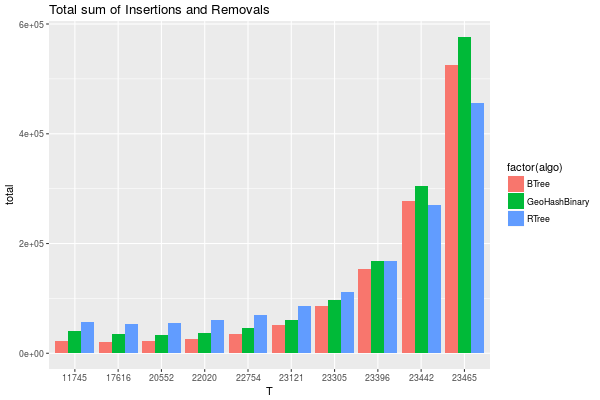

================
Experiment Diary
================

    :Author: julio

.. contents::

1 Design of Experiment :export:
----------------------

PMA remove elements timely before doubling the array.
The array double only when :math:`\tau` \* PMA\_Capacity it reached. 

For several PMA sizes, how is the performance of the remove operation? 
Variables that may affect the remove performance:

- Amount of elements removed at each time: 

  - as a percentage of the total of elements in the data structure.

  - as an absolute value of elements removed.

- Size of the data structure: because before each removal we need to scan the storage array.

1.1 Computation of PMA Capacity
~~~~~~~~~~~~~~~~~~~~~~~~~~~~~~~

Pma Capacity is computed based on the desired number of elements to store and the :math:`\tau` parameter:

.. code:: python
    :name: PmaCap

    import math as m
    def tauInit(n,th):
        s = n / th / 8
        seg = 2**(m.ceil(m.log2(s)))
        return seg*8

    print( tauInit(n,th))

::

    2048

1.2 Computation of size and frequency of remove operations
~~~~~~~~~~~~~~~~~~~~~~~~~~~~~~~~~~~~~~~~~~~~~~~~~~~~~~~~~~

Time window size
    a lower bound on the amount of ``Batches`` we will keep in-memory 

Batch size
    the number of elements inserted in each batch

EMin
    the lower bound of the amount of *elements* kept in memory ( time window × batch size ).

PMA Size
    The capacity of the PMA computed to store ``EMin`` elements given a :math:`\tau` value of ``0.7``

Tau Size
    The amount of elements at which the given PMA will be required to remove elements. ( PMA Size × :math:`\tau`)

.. table:: Example

    +------------------+-------+-------+----------+----------+----------+------------------------+------+----------------------+------------+
    | Time Window Size | Batch |  EMin | PMA Size | Rho Size | Tau Size | First removal at batch | #del | Interval (# Batches) |       rm % |
    +==================+=======+=======+==========+==========+==========+========================+======+======================+============+
    |               15 |  1000 | 15000 |    32768 |    10000 |    22000 |                     22 | 8000 |                    8 | 0.36363636 |
    +------------------+-------+-------+----------+----------+----------+------------------------+------+----------------------+------------+

We first will test , for a fixed PMA Size, how the percentage of removals affects the performance.

We choose a target Emin = 21600000 and compute the resulting PMA Capacity:
PmaCap(n=21600000,th=0.7) = ``33554432``. 

This will result in the following setup: 

.. table::

    +------------------+-------+----------+----------+----------+----------+------------------------+---------+----------------------+-------------+
    | Time Window Size | Batch |     EMin | PMA Size | Rho Size | Tau Size | First removal at batch |    #del | Interval (# Batches) |        rm % |
    +==================+=======+==========+==========+==========+==========+========================+=========+======================+=============+
    |            21600 |  1000 | 21600000 | 33554432 | 10067000 | 23488000 |                  23488 | 1889000 |                 1889 | 0.080424046 |
    +------------------+-------+----------+----------+----------+----------+------------------------+---------+----------------------+-------------+

The minimum ``EMin`` value that result in a PMA Size of ``33554432`` is :math:`\frac{PMA\_SIZE}{2}+1` = ``11744052.2`` . 
Example: 

- tauInit(n=11744052,th=0.7) =  ``33554432``

- tauInit(n=11744051,th=0.7) =  ``16777216``

The maximum ``EMin`` value with the this same size is equal to :math:`PMA\_SIZE \times \tau_h` = ``23488102.4`` ( when :math:`\tau`\ :sub:`h`\ is ``0.7`` ) .

We generate several window sizes to test with the allow boundaries of chosen PMA size.

.. code:: python

    import math as m
    batch = 1000
    minWs = m.ceil(11744052 / batch)
    maxWs = m.floor(23488102.4 / batch)

    # Possible variation of window size.
    diff = maxWs - minWs;

    # Increase the window size logarithmicly from minWs to MaxWs
    wSizes = [ round(maxWs - diff/2**i) for i in range(0,10) ]
    print( wSizes )
    #print ("| Window Size",*wSizes,sep="|\n| ")

    #wSizes = [ round(minWs + diff/2**i) for i in range(0,10) ]
    #print (wSizes)

::

    [11745, 17616, 20552, 22020, 22754, 23121, 23305, 23396, 23442, 23465]

.. table:: Experiment variables

    +------------------+-------+----------+----------+----------+----------+------------------------+----------+----------------------+--------------+
    | Time Window Size | Batch |     EMin | PMA Size | Rho Size | Tau Size | First removal at batch |     #del | Interval (# Batches) |         rm % |
    +==================+=======+==========+==========+==========+==========+========================+==========+======================+==============+
    |            11745 |  1000 | 11745000 | 33554432 | 10067000 | 23488000 |                  23488 | 11744000 |                11744 |          0.5 |
    +------------------+-------+----------+----------+----------+----------+------------------------+----------+----------------------+--------------+
    |            17616 |  1000 | 17616000 | 33554432 | 10067000 | 23488000 |                  23488 |  5873000 |                 5873 |   0.25004257 |
    +------------------+-------+----------+----------+----------+----------+------------------------+----------+----------------------+--------------+
    |            20552 |  1000 | 20552000 | 33554432 | 10067000 | 23488000 |                  23488 |  2937000 |                 2937 |   0.12504257 |
    +------------------+-------+----------+----------+----------+----------+------------------------+----------+----------------------+--------------+
    |            22020 |  1000 | 22020000 | 33554432 | 10067000 | 23488000 |                  23488 |  1469000 |                 1469 |  0.062542575 |
    +------------------+-------+----------+----------+----------+----------+------------------------+----------+----------------------+--------------+
    |            22754 |  1000 | 22754000 | 33554432 | 10067000 | 23488000 |                  23488 |   735000 |                  735 |  0.031292575 |
    +------------------+-------+----------+----------+----------+----------+------------------------+----------+----------------------+--------------+
    |            23121 |  1000 | 23121000 | 33554432 | 10067000 | 23488000 |                  23488 |   368000 |                  368 |  0.015667575 |
    +------------------+-------+----------+----------+----------+----------+------------------------+----------+----------------------+--------------+
    |            23305 |  1000 | 23305000 | 33554432 | 10067000 | 23488000 |                  23488 |   184000 |                  184 | 7.8337875e-3 |
    +------------------+-------+----------+----------+----------+----------+------------------------+----------+----------------------+--------------+
    |            23396 |  1000 | 23396000 | 33554432 | 10067000 | 23488000 |                  23488 |    93000 |                   93 | 3.9594687e-3 |
    +------------------+-------+----------+----------+----------+----------+------------------------+----------+----------------------+--------------+
    |            23442 |  1000 | 23442000 | 33554432 | 10067000 | 23488000 |                  23488 |    47000 |                   47 | 2.0010218e-3 |
    +------------------+-------+----------+----------+----------+----------+------------------------+----------+----------------------+--------------+
    |            23465 |  1000 | 23465000 | 33554432 | 10067000 | 23488000 |                  23488 |    24000 |                   24 | 1.0217984e-3 |
    +------------------+-------+----------+----------+----------+----------+------------------------+----------+----------------------+--------------+

1.3 Parameters for RTree and Btree
~~~~~~~~~~~~~~~~~~~~~~~~~~~~~~~~~~

To compare the BTree / TREE with the PMQ we will define a MAXSIZE that these data structure can have.
This way we afford some slack to perform the removals. 

We set the max size equal to the max number of elements that the PMA can host ( ``Tau Size`` ). 
At each removal all the elements inserted more ``T`` Batches in the past are deleted. 

.. table::

    +----------------------------+-------+---------------------------+----------+---------------+-----------------------------+
    | Time Window Size (Batches) | Batch | n elts (min elts in tree) | PMA Size | % of Tau Size | Tau Size (Max elts in tree) |
    +============================+=======+===========================+==========+===============+=============================+
    |                      11745 |  1000 |                  11745000 | 33554432 |    0.50004257 |                    23488000 |
    +----------------------------+-------+---------------------------+----------+---------------+-----------------------------+
    |                      17616 |  1000 |                  17616000 | 33554432 |          0.75 |                    23488000 |
    +----------------------------+-------+---------------------------+----------+---------------+-----------------------------+
    |                      20552 |  1000 |                  20552000 | 33554432 |         0.875 |                    23488000 |
    +----------------------------+-------+---------------------------+----------+---------------+-----------------------------+
    |                      22020 |  1000 |                  22020000 | 33554432 |        0.9375 |                    23488000 |
    +----------------------------+-------+---------------------------+----------+---------------+-----------------------------+
    |                      22754 |  1000 |                  22754000 | 33554432 |       0.96875 |                    23488000 |
    +----------------------------+-------+---------------------------+----------+---------------+-----------------------------+
    |                      23121 |  1000 |                  23121000 | 33554432 |      0.984375 |                    23488000 |
    +----------------------------+-------+---------------------------+----------+---------------+-----------------------------+
    |                      23305 |  1000 |                  23305000 | 33554432 |    0.99220879 |                    23488000 |
    +----------------------------+-------+---------------------------+----------+---------------+-----------------------------+
    |                      23396 |  1000 |                  23396000 | 33554432 |    0.99608311 |                    23488000 |
    +----------------------------+-------+---------------------------+----------+---------------+-----------------------------+
    |                      23442 |  1000 |                  23442000 | 33554432 |    0.99804155 |                    23488000 |
    +----------------------------+-------+---------------------------+----------+---------------+-----------------------------+
    |                      23465 |  1000 |                  23465000 | 33554432 |    0.99902078 |                    23488000 |
    +----------------------------+-------+---------------------------+----------+---------------+-----------------------------+

1.4 Execution parameters
~~~~~~~~~~~~~~~~~~~~~~~~

.. table::
    :name: execParam

    +------------------+-------+----------+----------------------+
    | Time Window Size | Batch |    tSize | Results in removal % |
    +==================+=======+==========+======================+
    |            11745 |  1000 | 23488000 |                  0.5 |
    +------------------+-------+----------+----------------------+
    |            17616 |  1000 | 23488000 |           0.25004257 |
    +------------------+-------+----------+----------------------+
    |            20552 |  1000 | 23488000 |           0.12504257 |
    +------------------+-------+----------+----------------------+
    |            22020 |  1000 | 23488000 |          0.062542575 |
    +------------------+-------+----------+----------------------+
    |            22754 |  1000 | 23488000 |          0.031292575 |
    +------------------+-------+----------+----------------------+
    |            23121 |  1000 | 23488000 |          0.015667575 |
    +------------------+-------+----------+----------------------+
    |            23305 |  1000 | 23488000 |         7.8337875e-3 |
    +------------------+-------+----------+----------------------+
    |            23396 |  1000 | 23488000 |         3.9594687e-3 |
    +------------------+-------+----------+----------------------+
    |            23442 |  1000 | 23488000 |         2.0010218e-3 |
    +------------------+-------+----------+----------------------+
    |            23465 |  1000 | 23488000 |         1.0217984e-3 |
    +------------------+-------+----------+----------------------+

We will run the experiment inserting ``46976000`` elements.
The measured times are reported in terms of % of Removals:

.. table::

    +--------------+-------------------+------------------------+
    | % of elts RM | Time of the RM OP | Avg time of the Period |
    +==============+===================+========================+
    |        0.500 | \                 | \                      |
    +--------------+-------------------+------------------------+
    |        0.250 | \                 | \                      |
    +--------------+-------------------+------------------------+
    |        0.125 | \                 | \                      |
    +--------------+-------------------+------------------------+
    |        0.063 | \                 | \                      |
    +--------------+-------------------+------------------------+
    |        0.031 | \                 | \                      |
    +--------------+-------------------+------------------------+
    |        0.016 | \                 | \                      |
    +--------------+-------------------+------------------------+
    |        0.008 | \                 | \                      |
    +--------------+-------------------+------------------------+
    |        0.004 | \                 | \                      |
    +--------------+-------------------+------------------------+
    |        0.002 | \                 | \                      |
    +--------------+-------------------+------------------------+
    |        0.001 | \                 | \                      |
    +--------------+-------------------+------------------------+

2 Analisys
----------

2.1 Results
~~~~~~~~~~~

2.1.1 Summary Tables of Remove Times :export:
^^^^^^^^^^^^^^^^^^^^^^^^^^^^^^^^^^^^

.. code:: R

    df %>% filter(remove > 0) %>%
        group_by(algo,T) %>%
        summarize(RemoveTime = signif(mean(as.numeric(remove))), stdv = signif(sd(as.numeric(remove)))) %>%
        arrange(T,algo)

.. table::

    +---------------+-------+------------+---------+
    | algo          |     T | RemoveTime |    stdv |
    +===============+=======+============+=========+
    | BTree         | 11745 |    3100.06 | 17.2888 |
    +---------------+-------+------------+---------+
    | GeoHashBinary | 11745 |    655.565 | 13.6641 |
    +---------------+-------+------------+---------+
    | RTree         | 11745 |    10274.9 | 586.411 |
    +---------------+-------+------------+---------+
    | BTree         | 17616 |    2036.75 | 25.0953 |
    +---------------+-------+------------+---------+
    | GeoHashBinary | 17616 |    675.602 | 13.8337 |
    +---------------+-------+------------+---------+
    | RTree         | 17616 |    6037.96 | 261.868 |
    +---------------+-------+------------+---------+
    | BTree         | 20552 |    1418.43 | 25.5424 |
    +---------------+-------+------------+---------+
    | GeoHashBinary | 20552 |    662.776 | 10.9497 |
    +---------------+-------+------------+---------+
    | RTree         | 20552 |    3661.58 | 69.8569 |
    +---------------+-------+------------+---------+
    | BTree         | 22020 |    1055.16 | 19.9216 |
    +---------------+-------+------------+---------+
    | GeoHashBinary | 22020 |    658.074 | 8.00363 |
    +---------------+-------+------------+---------+
    | RTree         | 22020 |    2276.79 | 60.3141 |
    +---------------+-------+------------+---------+
    | BTree         | 22754 |    829.013 | 14.5278 |
    +---------------+-------+------------+---------+
    | GeoHashBinary | 22754 |    652.435 | 6.01608 |
    +---------------+-------+------------+---------+
    | RTree         | 22754 |    1466.19 | 44.3631 |
    +---------------+-------+------------+---------+
    | BTree         | 23121 |    709.294 | 12.3565 |
    +---------------+-------+------------+---------+
    | GeoHashBinary | 23121 |    604.964 | 4.68194 |
    +---------------+-------+------------+---------+
    | RTree         | 23121 |     1014.4 | 34.1498 |
    +---------------+-------+------------+---------+
    | BTree         | 23305 |    651.033 | 11.2973 |
    +---------------+-------+------------+---------+
    | GeoHashBinary | 23305 |    606.779 | 3.53975 |
    +---------------+-------+------------+---------+
    | RTree         | 23305 |    741.601 | 20.4287 |
    +---------------+-------+------------+---------+
    | BTree         | 23396 |    596.991 | 12.3706 |
    +---------------+-------+------------+---------+
    | GeoHashBinary | 23396 |    608.559 | 2.47598 |
    +---------------+-------+------------+---------+
    | RTree         | 23396 |    604.497 |  21.108 |
    +---------------+-------+------------+---------+
    | BTree         | 23442 |    585.298 |  10.511 |
    +---------------+-------+------------+---------+
    | GeoHashBinary | 23442 |    615.599 | 3.09548 |
    +---------------+-------+------------+---------+
    | RTree         | 23442 |    522.008 | 15.3026 |
    +---------------+-------+------------+---------+
    | BTree         | 23465 |    568.854 | 10.2702 |
    +---------------+-------+------------+---------+
    | GeoHashBinary | 23465 |    611.594 | 2.81889 |
    +---------------+-------+------------+---------+
    | RTree         | 23465 |    473.858 | 12.2305 |
    +---------------+-------+------------+---------+

2.1.2 Overview of results :export:plot:
^^^^^^^^^^^^^^^^^^^^^^^^^

Plot an overview of every benchmark , doing average of times. 

.. code:: R

    df %>% filter(remove > 0) %>% 
        mutate(remove=as.numeric(remove)) %>%
        mutate(remove=ifelse(algo != "GeoHashBinary", remove + insert, remove)) %>% # Remove actually accounts for remove + a small insertion 
        group_by(algo,T) %>%
        summarize(RemoveTime = mean(as.numeric(remove)), stdv = sd(as.numeric(remove))) %>%
        mutate(T = as.factor(T))-> dfplot

    dfplot

.. code:: R

    library(ggplot2)

    dfplot %>% 
        ggplot( aes(x=T,y=RemoveTime, fill=factor(algo))) + 
        geom_bar(stat="identity", position="dodge")+
        geom_errorbar( position=position_dodge(0.9), 
                       aes(ymin = RemoveTime - stdv, ymax = RemoveTime + stdv), width=0.5)

2.1.3 Insertion performance
^^^^^^^^^^^^^^^^^^^^^^^^^^^

.. code:: R

    df %>% filter(is.na(remove)) %>%  # get only lines with no removes
           mutate(remove=as.numeric(remove)) %>%
           mutate(T = as.factor(T))-> dfinsert

    dfinsert

2.1.3.1 Overall :export:plot:
:::::::::::::::

.. code:: R

    dfinsert %>%
    ggplot(aes(x=id,y=insert, color=factor(algo))) + 
    geom_line() +
    labs(title = "Insertions") + 
    facet_wrap(~T, scales="free")

.. image:: ./img/overallInsertion.png

2.1.3.1.1 Total insertion time (without the removals) :
'''''''''''''''''''''''''''''''''''''''''''''''''''''''

.. code:: R

    dfinsert %>% 
        group_by(algo, T) %>%
        summarize(Average = signif(mean(insert)), Stdv = signif(sd(insert)), Total = signif(sum(insert))) %>%
    arrange(T,algo)

.. table::

    +---------------+-------+----------+-----------+---------+
    | algo          |     T |  Average |      Stdv |   Total |
    +===============+=======+==========+===========+=========+
    | BTree         | 11745 | 0.495382 | 0.0255292 | 17451.8 |
    +---------------+-------+----------+-----------+---------+
    | GeoHashBinary | 11745 |  1.12823 | 0.0315277 | 39746.3 |
    +---------------+-------+----------+-----------+---------+
    | RTree         | 11745 |  1.08808 | 0.0785254 | 38331.9 |
    +---------------+-------+----------+-----------+---------+
    | BTree         | 17616 | 0.509947 | 0.0228411 |   14970 |
    +---------------+-------+----------+-----------+---------+
    | GeoHashBinary | 17616 |  1.12955 | 0.0243671 |   33159 |
    +---------------+-------+----------+-----------+---------+
    | RTree         | 17616 |  1.08252 | 0.0738378 | 31778.4 |
    +---------------+-------+----------+-----------+---------+
    | BTree         | 20552 | 0.502184 | 0.0210777 | 13265.7 |
    +---------------+-------+----------+-----------+---------+
    | GeoHashBinary | 20552 |  1.11536 |  0.015826 | 29463.4 |
    +---------------+-------+----------+-----------+---------+
    | RTree         | 20552 |  1.06048 | 0.0596721 | 28013.5 |
    +---------------+-------+----------+-----------+---------+
    | BTree         | 22020 | 0.504608 | 0.0204988 | 12584.9 |
    +---------------+-------+----------+-----------+---------+
    | GeoHashBinary | 22020 |  1.12174 | 0.0149165 | 27976.1 |
    +---------------+-------+----------+-----------+---------+
    | RTree         | 22020 |  1.06306 | 0.0500795 | 26512.8 |
    +---------------+-------+----------+-----------+---------+
    | BTree         | 22754 | 0.498483 | 0.0155592 | 12058.3 |
    +---------------+-------+----------+-----------+---------+
    | GeoHashBinary | 22754 |  1.11479 | 0.0151073 | 26966.8 |
    +---------------+-------+----------+-----------+---------+
    | RTree         | 22754 |  1.06271 | 0.0425487 | 25706.9 |
    +---------------+-------+----------+-----------+---------+
    | BTree         | 23121 | 0.499434 | 0.0162469 |   11882 |
    +---------------+-------+----------+-----------+---------+
    | GeoHashBinary | 23121 |  1.12981 | 0.0164901 | 26879.3 |
    +---------------+-------+----------+-----------+---------+
    | RTree         | 23121 |  1.08129 |  0.041588 |   25725 |
    +---------------+-------+----------+-----------+---------+
    | BTree         | 23305 | 0.506284 | 0.0180502 | 11919.5 |
    +---------------+-------+----------+-----------+---------+
    | GeoHashBinary | 23305 |  1.13558 | 0.0142027 |   26735 |
    +---------------+-------+----------+-----------+---------+
    | RTree         | 23305 |  1.08075 | 0.0489447 | 25444.1 |
    +---------------+-------+----------+-----------+---------+
    | BTree         | 23396 | 0.497812 | 0.0221871 | 11612.5 |
    +---------------+-------+----------+-----------+---------+
    | GeoHashBinary | 23396 |  1.11638 | 0.0143327 | 26041.8 |
    +---------------+-------+----------+-----------+---------+
    | RTree         | 23396 |   1.0969 | 0.0472797 | 25587.3 |
    +---------------+-------+----------+-----------+---------+
    | BTree         | 23442 |  0.51838 | 0.0202741 | 11940.4 |
    +---------------+-------+----------+-----------+---------+
    | GeoHashBinary | 23442 |  1.13043 | 0.0139346 | 26038.2 |
    +---------------+-------+----------+-----------+---------+
    | RTree         | 23442 |  1.11573 | 0.0476103 | 25699.8 |
    +---------------+-------+----------+-----------+---------+
    | BTree         | 23465 | 0.528365 | 0.0195954 | 11905.1 |
    +---------------+-------+----------+-----------+---------+
    | GeoHashBinary | 23465 |  1.11899 | 0.0164199 | 25213.1 |
    +---------------+-------+----------+-----------+---------+
    | RTree         | 23465 |   1.1056 | 0.0431989 | 24911.5 |
    +---------------+-------+----------+-----------+---------+

.. code:: R

    library(ggplot2)

    dfinsert %>% 
        group_by(algo, T) %>%
        summarize(avg = mean(insert), stdv = sd(insert)) %>%
        ggplot( aes(x="",y=avg, fill=factor(algo))) + 
        geom_bar(stat="identity", position="dodge")+
        geom_errorbar( position=position_dodge(0.9), 
                       aes(ymin = avg - stdv, ymax = avg + stdv), width=0.5) +
        facet_wrap(~T, scale="free_x")+ 
        labs(title = "Average Insertions (without removals)") 

.. image:: ./img/averageInsOnly.png

2.1.3.1.2 Total benchmark time with the removals:
'''''''''''''''''''''''''''''''''''''''''''''''''

.. code:: R

    options(digits=6)
    df %>% 
        mutate(remove = if_else(is.na(remove), 0 , as.numeric(remove))) %>%
        mutate(ins_rm=if_else(algo == "GeoHashBinary", insert, as.numeric(remove) + insert)) %>% 
        group_by(algo,T) %>%
        summarize(AvgTime = signif(mean(ins_rm)), stdv = signif(sd(ins_rm)), total = signif(sum(ins_rm))) %>%
        mutate(T = as.factor(T))-> dfTotals

    dfTotals %>% arrange(T,algo)

.. table::

    +---------------+-------+----------+---------+---------+
    | algo          |     T |  AvgTime |    stdv |   total |
    +===============+=======+==========+=========+=========+
    | BTree         | 11745 | 0.671368 | 23.3574 |   23653 |
    +---------------+-------+----------+---------+---------+
    | GeoHashBinary | 11745 |  1.16538 |  4.9314 | 41057.5 |
    +---------------+-------+----------+---------+---------+
    | RTree         | 11745 |  1.67137 | 77.4789 | 58884.2 |
    +---------------+-------+----------+---------+---------+
    | BTree         | 17616 | 0.787435 | 23.7736 | 23119.1 |
    +---------------+-------+----------+---------+---------+
    | GeoHashBinary | 17616 |  1.22144 | 7.87344 | 35861.4 |
    +---------------+-------+----------+---------+---------+
    | RTree         | 17616 |  1.90514 | 70.5232 | 55934.9 |
    +---------------+-------+----------+---------+---------+
    | BTree         | 20552 | 0.931626 |  24.681 | 24617.3 |
    +---------------+-------+----------+---------+---------+
    | GeoHashBinary | 20552 |  1.31568 | 11.5127 | 34765.6 |
    +---------------+-------+----------+---------+---------+
    | RTree         | 20552 |  2.16905 | 63.7135 |   57315 |
    +---------------+-------+----------+---------+---------+
    | BTree         | 22020 |  1.18111 | 26.7139 | 29475.7 |
    +---------------+-------+----------+---------+---------+
    | GeoHashBinary | 22020 |  1.54293 | 16.6305 | 38505.3 |
    +---------------+-------+----------+---------+---------+
    | RTree         | 22020 |  2.52279 | 57.6517 | 62958.8 |
    +---------------+-------+----------+---------+---------+
    | BTree         | 22754 |  1.59371 | 30.1175 | 38602.7 |
    +---------------+-------+----------+---------+---------+
    | GeoHashBinary | 22754 |  1.97526 | 23.6595 | 47844.7 |
    +---------------+-------+----------+---------+---------+
    | RTree         | 22754 |  2.99974 |  53.282 | 72659.6 |
    +---------------+-------+----------+---------+---------+
    | BTree         | 23121 |  2.40239 |  36.696 |   57309 |
    +---------------+-------+----------+---------+---------+
    | GeoHashBinary | 23121 |  2.74982 | 31.2361 | 65597.1 |
    +---------------+-------+----------+---------+---------+
    | RTree         | 23121 |  3.80278 | 52.5019 | 90715.3 |
    +---------------+-------+----------+---------+---------+
    | BTree         | 23305 |  4.02671 | 47.7524 | 95316.1 |
    +---------------+-------+----------+---------+---------+
    | GeoHashBinary | 23305 |  4.41057 | 44.4174 |  104403 |
    +---------------+-------+----------+---------+---------+
    | RTree         | 23305 |  5.09086 | 54.4071 |  120506 |
    +---------------+-------+----------+---------+---------+
    | BTree         | 23396 |  6.90307 |  61.519 |  162774 |
    +---------------+-------+----------+---------+---------+
    | GeoHashBinary | 23396 |  7.63389 | 62.5841 |  180007 |
    +---------------+-------+----------+---------+---------+
    | RTree         | 23396 |  7.58268 | 62.3171 |  178800 |
    +---------------+-------+----------+---------+---------+
    | BTree         | 23442 |  12.9531 | 84.4147 |  304839 |
    +---------------+-------+----------+---------+---------+
    | GeoHashBinary | 23442 |  14.1853 | 88.6112 |  333838 |
    +---------------+-------+----------+---------+---------+
    | RTree         | 23442 |  12.2057 | 75.3058 |  287249 |
    +---------------+-------+----------+---------+---------+
    | BTree         | 23465 |  24.2147 | 113.655 |  569311 |
    +---------------+-------+----------+---------+---------+
    | GeoHashBinary | 23465 |  26.5392 | 121.956 |  623964 |
    +---------------+-------+----------+---------+---------+
    | RTree         | 23465 |  20.8363 | 94.6915 |  489883 |
    +---------------+-------+----------+---------+---------+

.. code:: R

    df %>% 
        mutate(remove = if_else(is.na(remove), 0 , as.numeric(remove))) %>%
        mutate(ins_rm=if_else(algo == "GeoHashBinary", insert, as.numeric(remove) + insert)) %>% 
        group_by(algo,T) %>%
        summarize(total = sum(ins_rm)) %>%
        mutate(T = as.factor(T)) -> totalPlot
    totalPlot

.. code:: R

    library(ggplot2)

    totalPlot %>%
        ggplot( aes(x=T,y=total, fill=factor(algo))) + 
        geom_bar(stat="identity", position="dodge")+
        labs(title = "Total sum of Insertions and Removals") 

