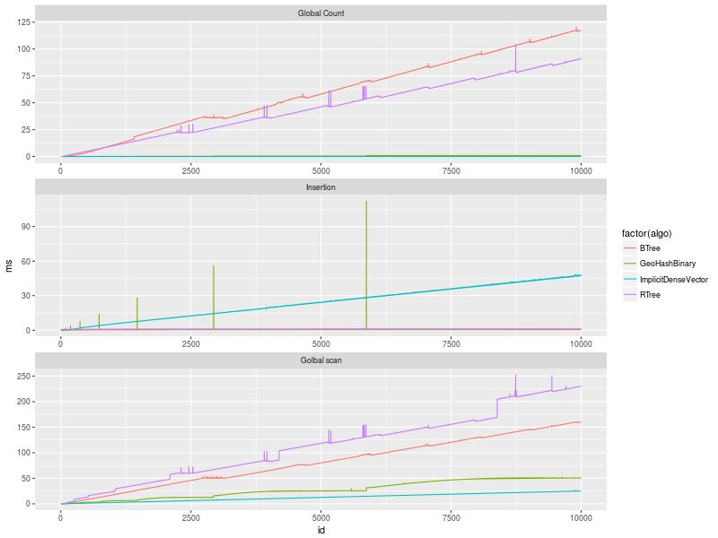
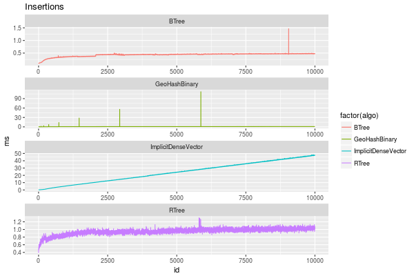
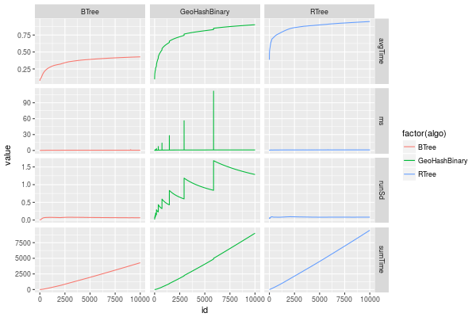
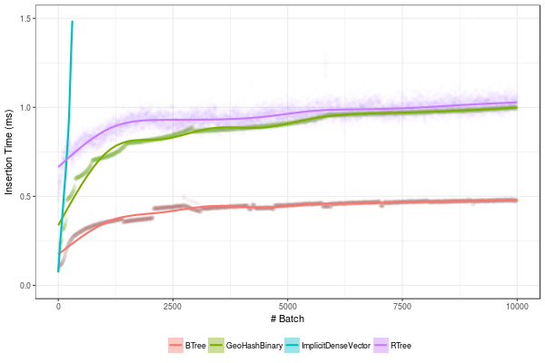

====================
Benchmark Insertions
====================

.. contents::

1 Description
-------------

Benchnark insertion time

- PMQ / GEOHASH

- BTREE

- RTREE -  Quadratic algorithm

- Dense vector

Number of insertions: 
elements of size 32 bytes:

- Key = 8 bytes

- Value = (19) aligned to 24 Bytes

- PMA batch size = 1000

350 million elements = *10.43081283569336* GB .

Will use a PMA of 16 GB

The 350 M elements benchmark takes to long, mainly due to to the global scan operations done after each insertion.

We will re-run this experiment with 10 M elements. Batch of size 1000. 
To test with 350 we should disable the scans. 

With 10 M elemtents PMA has size *512.0* Megabytes. 

Tests with larger Size will be done in the querying and scanning benchmark.

2 Analisys
----------

2.1 Results
~~~~~~~~~~~

2.1.1 Overview of results
^^^^^^^^^^^^^^^^^^^^^^^^^

Plot an overview of every benchmark , doing average of times. 

.. code:: R

    library(ggplot2)

    dfplot %>% 
      #  filter( id < 100) %>%
    #    ungroup %>% 
     #   mutate(bench = revalue( bench, c("apply_at_region" = "count"))) %>% 
    ggplot(aes(x=id,y=ms, color=factor(algo))) + 
        geom_line() +
        #geom_errorbar(aes(ymin = ms - stdv, ymax = ms + stdv), width = 0.3 ) +
        facet_wrap(~bench, scales="free",ncol=1,labeller=labeller(bench=c(apply_at_region="Global Count", insert="Insertion", scan_at_region="Golbal scan")))

2.1.2 Insertion performance
^^^^^^^^^^^^^^^^^^^^^^^^^^^

.. code:: R

    dfplot %>% filter( bench == "insert") -> dfinsert

2.1.2.1 Overall
:::::::::::::::

.. code:: R

    dfinsert %>%
    ggplot(aes(x=id,y=ms, color=factor(algo))) + 
    geom_line() +
    labs(title = "Insertions") + 
    facet_wrap(~algo, scales="free", ncol=1)

Total insertion time:

.. code:: R

    dfinsert %>% 
        group_by(algo) %>%
        summarize(Average = mean(ms), Total = sum(ms)) %>% arrange (Total)

.. table::

    +---------------------+---------+------------+
    | algo                | Average |      Total |
    +=====================+=========+============+
    | BTree               |   0.698 |   6976.455 |
    +---------------------+---------+------------+
    | RTree               |   0.967 |   9669.935 |
    +---------------------+---------+------------+
    | GeoHashBinary       |   1.015 |  10154.884 |
    +---------------------+---------+------------+
    | ImplicitDenseVector |  24.925 | 249248.270 |
    +---------------------+---------+------------+

2.1.2.2 Amortized time
::::::::::::::::::::::

We compute three times:

- individual insertion time for each batch

- accumulated time at batch #k

- ammortized time : average of the past times at batch #k

2.1.2.2.1 Comparison Time X avgTime
'''''''''''''''''''''''''''''''''''

.. code:: R

    melted_times %>%
        ggplot(aes(x=id,y=value,color=factor(algo))) +
    geom_line() + 
    facet_grid(stat~algo,scales="free", labeller=labeller(stat=label_value))
    #facet_wrap(variable~algo,scales="free", labeller=labeller(variable=label_value))

2.1.2.3 Zoom View
:::::::::::::::::

.. code:: R

    avgTime %>% 
        ggplot(aes(x=id, color=factor(algo))) + 
        labs(title="Insertions") +
        geom_point(aes(y=ms), alpha=1) +
    #    geom_line(aes(y=avgTime)) + 
        ylim(0,1.5) 

