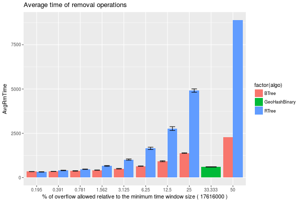
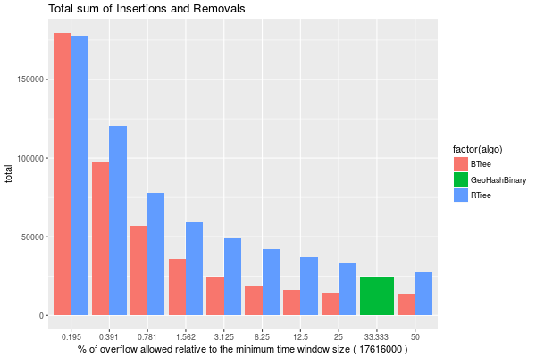
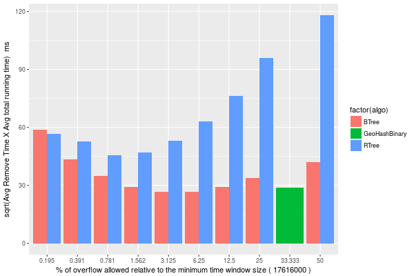
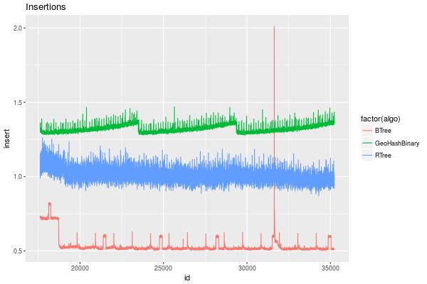
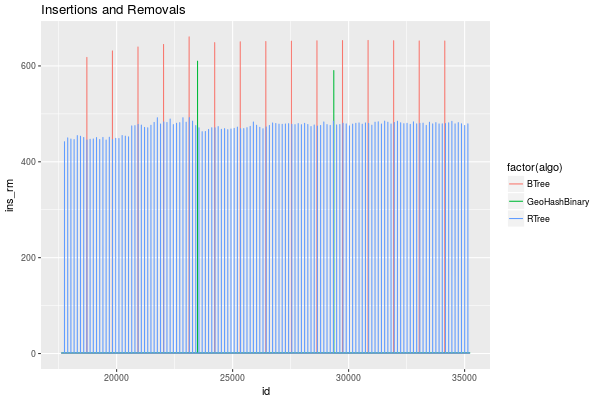
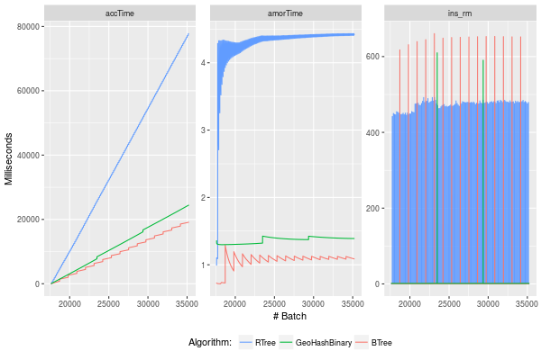

=================
Removal benchmark
=================

.. contents::

1 Design of Experiment
----------------------

PMA cannot be parameterized by the remove frequency, this is set "automatically" by the size of the time window T. 

For a same time window size, we want to find the best frequency to trigger removals on the Btree and Rtree.

The previous experiment (`../exp20170914091842/exp.rst <../exp20170914091842/exp.rst>`_) showed that PMA of size 33554432 is "optimal" at T 17616, case where it triggers the removal when the T has overflowed by 33.33 %.

For Btree and Rtree, test the overflow limit (tSize parameter) ranging from:

.. code:: python

    maxVal = 0.5
    overFlow = [ (maxVal / 2**i) for i in range(0,9)]
    print(overFlow)

    T = 17616000
    tSize = [round(T + T * e) for e in overFlow]
    print(tSize)

::

    >>> [0.5, 0.25, 0.125, 0.0625, 0.03125, 0.015625, 0.0078125, 0.00390625, 0.001953125]
    >>> >>> >>> [26424000, 22020000, 19818000, 18717000, 18166500, 17891250, 17753625, 17684812, 17650406]

2 Analysis
----------

2.1 Results
~~~~~~~~~~~

2.1.1 Summary Table of Removal Times
^^^^^^^^^^^^^^^^^^^^^^^^^^^^^^^^^^^^

.. code:: R

    df %>% filter(!is.na(remove)) %>% # get only the removal operations 
        group_by(algo,tSize) %>%
        summarize(TotRmTime = sum(remove), 
                  AvgRmTime = (mean(remove)), 
                  stdv = sd(remove), 
                  n = length(remove),
                  pct = mean( 
                       (as.numeric(as.character(tSize)) - T*1000) * 100 / (T*1000)   ) 
                  ) %>%
        arrange(algo,AvgRmTime)

.. table::

    +---------------+----------+------------+-----------+---------+---------+--------+
    | algo          |    tSize |  TotRmTime | AvgRmTime |    stdv |       n |    pct |
    +===============+==========+============+===========+=========+=========+========+
    | BTree         | 17650406 | 169900.920 |   337.775 |   5.658 | 503.000 |  0.195 |
    +---------------+----------+------------+-----------+---------+---------+--------+
    | BTree         | 17684812 |  87782.133 |   344.244 |   4.814 | 255.000 |  0.391 |
    +---------------+----------+------------+-----------+---------+---------+--------+
    | BTree         | 17753625 |  47491.581 |   373.949 |  13.101 | 127.000 |  0.781 |
    +---------------+----------+------------+-----------+---------+---------+--------+
    | BTree         | 17891250 |  26499.137 |   420.621 |  10.833 |  63.000 |  1.562 |
    +---------------+----------+------------+-----------+---------+---------+--------+
    | BTree         | 18166500 |  15575.801 |   502.445 |  14.137 |  31.000 |  3.125 |
    +---------------+----------+------------+-----------+---------+---------+--------+
    | BTree         | 18717000 |   9703.319 |   646.888 |  10.680 |  15.000 |  6.250 |
    +---------------+----------+------------+-----------+---------+---------+--------+
    | BTree         | 19818000 |   6460.686 |   922.955 |  27.436 |   7.000 | 12.500 |
    +---------------+----------+------------+-----------+---------+---------+--------+
    | BTree         | 22020000 |   4151.060 |  1383.687 |  16.329 |   3.000 | 25.000 |
    +---------------+----------+------------+-----------+---------+---------+--------+
    | BTree         | 26424000 |   2292.220 |  2292.220 |   0.000 |   1.000 | 50.000 |
    +---------------+----------+------------+-----------+---------+---------+--------+
    | GeoHashBinary | 23488000 |   1200.340 |   600.170 |  13.868 |   2.000 | 33.333 |
    +---------------+----------+------------+-----------+---------+---------+--------+
    | RTree         | 17650406 | 159922.830 |   317.938 |  10.250 | 503.000 |  0.195 |
    +---------------+----------+------------+-----------+---------+---------+--------+
    | RTree         | 17684812 | 102621.560 |   402.437 |  14.492 | 255.000 |  0.391 |
    +---------------+----------+------------+-----------+---------+---------+--------+
    | RTree         | 17753625 |  59966.378 |   472.176 |  11.908 | 127.000 |  0.781 |
    +---------------+----------+------------+-----------+---------+---------+--------+
    | RTree         | 17891250 |  41446.835 |   657.886 |  22.690 |  63.000 |  1.562 |
    +---------------+----------+------------+-----------+---------+---------+--------+
    | RTree         | 18166500 |  31455.575 |  1014.696 |  35.385 |  31.000 |  3.125 |
    +---------------+----------+------------+-----------+---------+---------+--------+
    | RTree         | 18717000 |  24744.220 |  1649.615 |  65.451 |  15.000 |  6.250 |
    +---------------+----------+------------+-----------+---------+---------+--------+
    | RTree         | 19818000 |  19370.180 |  2767.169 | 106.745 |   7.000 | 12.500 |
    +---------------+----------+------------+-----------+---------+---------+--------+
    | RTree         | 22020000 |  14734.050 |  4911.350 |  94.172 |   3.000 | 25.000 |
    +---------------+----------+------------+-----------+---------+---------+--------+
    | RTree         | 26424000 |   8895.700 |  8895.700 |   0.000 |   1.000 | 50.000 |
    +---------------+----------+------------+-----------+---------+---------+--------+

2.1.2 Removal Performance
^^^^^^^^^^^^^^^^^^^^^^^^^

Plot an overview of every benchmark , doing average of times. 

.. code:: R

    df %>% filter(!is.na(remove)) %>% 
        mutate(remove=ifelse(algo != "GeoHashBinary", remove + insert, remove)) %>% # Remove actually accounts for remove + a small insertion 
        group_by(algo,tSize) %>%
        summarize(AvgRmTime = mean(remove), 
                  TotRmTime = sum(remove), 
                  stdv = sd(remove), 
                  n = length(remove),
                  pct = mean( 
                       (as.numeric(as.character(tSize)) - T*1000) * 100 / (T*1000)   ) 
                  ) -> dfplot

    dfplot

.. code:: R

    library(ggplot2)

    dfplot %>%
    #    filter(algo == "GeoHashBinary") %>%
        ggplot( aes(x=factor(round(pct,3)),y=AvgRmTime, fill=factor(algo))) + 
        geom_bar(stat="identity", position="dodge")+
        geom_errorbar( position=position_dodge(0.9), 
                       aes(ymin = AvgRmTime - stdv, ymax = AvgRmTime + stdv), width=0.5)+
        labs(title = "Average time of removal operations",
             x = paste("% of overflow allowed relative to the minimum time window size (",df$T*1000,")") ) 

2.1.3 Total benchmark time (Insert + remove)
^^^^^^^^^^^^^^^^^^^^^^^^^^^^^^^^^^^^^^^^^^^^

.. code:: R

    library(ggplot2)

    dfTotals %>%
        ggplot( aes(x=as.factor(round(pct,3)),y=total, fill=factor(algo))) + 
        geom_bar(stat="identity", position="dodge")+
        labs(title = "Total sum of Insertions and Removals",
             x = paste("% of overflow allowed relative to the minimum time window size (",df$T*1000,")") ) 

2.1.4 Finding the optimal tradeoff
^^^^^^^^^^^^^^^^^^^^^^^^^^^^^^^^^^

We need to find a tradeoff between these two plots: 

Compute a tradeoff between total running time and time spent on removals. 

.. code:: R

    library(ggplot2)
    require(grid)
    library(scales)

    #inner_join(dfplot,totalPlot) %>% 
    inner_join(dfplot,dfTotals,by=c("algo","tSize","pct")) %>%
    #mutate ( ratio = (sqrt(RemoveTime * total))) %>%
    #mutate ( ratio = sqrt(RemoveSum * total)) %>%
    mutate ( ratio = (sqrt(AvgRmTime * AvgTime))) %>%
        ggplot( aes(x=as.factor(round(pct,3)),y=ratio, fill=factor(algo))) + 
        geom_bar(stat="identity", position="dodge") + 
        labs(y = "sqrt(Avg Remove Time X Avg total running time)  ms",
             x = paste("% of overflow allowed relative to the minimum time window size (",df$T*1000,")") ) 

Best T Values based on relation ( Avg Remove time × Avg running time): 

.. code:: R

    inner_join(dfplot,dfTotals,by=c("algo","tSize","pct")) %>%
    mutate ( ratio = (sqrt(AvgRmTime * AvgTime))) %>%
    group_by(algo) %>% 
    top_n(-1,ratio) -> tmp
    #names(tmp) = c("algo","T","Rm Time Avg","Rm Time Sum","Rm  stdv","Total Time sum","Total Time Avg","Total stdv","ratio")
    
    tmp %>% select(algo, tSize, pct, AvgRmTime, TotRmTime, AvgRunTime=AvgTime, TotRunTime=total, ratio) 

.. table::

    +---------------+----------+--------+-----------+-----------+------------+------------+--------+
    | algo          |    tSize |    pct | AvgRmTime | TotRmTime | AvgRunTime | TotRunTime |  ratio |
    +===============+==========+========+===========+===========+============+============+========+
    | BTree         | 18717000 |  6.250 |   647.423 |  9711.342 |      1.086 |  19134.232 | 26.518 |
    +---------------+----------+--------+-----------+-----------+------------+------------+--------+
    | GeoHashBinary | 23488000 | 33.333 |   600.170 |  1200.340 |      1.390 |  24484.896 | 28.882 |
    +---------------+----------+--------+-----------+-----------+------------+------------+--------+
    | RTree         | 17753625 |  0.781 |   473.174 | 60093.124 |      4.415 |  77777.578 | 45.707 |
    +---------------+----------+--------+-----------+-----------+------------+------------+--------+

NOTE
    I think it doesn't make sense to test the 33% overflow for RTree or Btree because it can only be worst that the optimal found above. 

2.1.5 Insertion performance (optimal parameters)
^^^^^^^^^^^^^^^^^^^^^^^^^^^^^^^^^^^^^^^^^^^^^^^^

Comparison of insertion with optimal parameters for each alogrithm. (omitted the removal operations)

.. code:: R

    df %>% 
    filter( is.na(remove)) %>% # Get only Lines where no remotion had happened
    filter( (algo=="GeoHashBinary") | 
            (algo=="BTree" & tSize == 18717000) |
            (algo=="RTree" & tSize == 17753625)) %>%
    ggplot(aes(x=id,y=insert, color=factor(algo))) + 
    geom_line() +
    #ylim(0,1.5) + 
    labs(title = "Insertions")
    #facet_wrap(~tSize, scales="free")

.. code:: R

    df %>% 
        filter( (algo=="GeoHashBinary") | 
                (algo=="BTree" & tSize == 18717000) |
                (algo=="RTree" & tSize == 17753625)) %>%
        mutate(remove = if_else(is.na(remove), 0 , remove)) %>%
        mutate(ins_rm=if_else(algo == "GeoHashBinary", insert, remove + insert)) %>% 
        ggplot(aes(x=id,y=ins_rm, color=factor(algo))) + 
        geom_line() +
        labs(title = "Insertions and Removals")

2.1.6 Amortized time
^^^^^^^^^^^^^^^^^^^^

2.1.6.1 Selected parameters with optimal insertion time
:::::::::::::::::::::::::::::::::::::::::::::::::::::::

.. code:: R

    df %>% 
        filter( (algo=="GeoHashBinary") | 
                (algo=="BTree" & tSize == 18717000) |
                (algo=="RTree" & tSize == 17753625)) %>%
        mutate(remove = if_else(is.na(remove), 0 , remove)) %>%
        mutate(ins_rm=if_else(algo == "GeoHashBinary", insert, remove + insert)) -> dfOptimal 

    dfOptimal %>% group_by(algo) %>% filter(remove > 0 ) %>% summarize(numberOfRemovals = length(remove)) 

::

    # A tibble: 3 x 2
               algo numberOfRemovals
              <chr>            <int>
    1         BTree               15
    2 GeoHashBinary                2
    3         RTree              127

We compute three times:

- individual insertion time for each batch

- accumulated time at batch #k

- ammortized time : average of the past times at batch #k

.. code:: R

    options(tibble.width = Inf)
    dfOptimal %>%
        group_by(algo) %>%
        mutate(accTime = cumsum(ins_rm) , 
               amorTime = cumsum(ins_rm)/row_number()) %>%
        arrange(algo) -> avgTime

    avgTime

::

    # A tibble: 52,848 x 10
    # Groups:   algo [3]
        algo     T    id    count   insert remove    tSize   ins_rm  accTime amorTime
       <chr> <int> <int>    <int>    <dbl>  <dbl>   <fctr>    <dbl>    <dbl>    <dbl>
     1 BTree 17616 17616 17617000 0.732565      0 18717000 0.732565 0.732565 0.732565
     2 BTree 17616 17617 17618000 0.730783      0 18717000 0.730783 1.463348 0.731674
     3 BTree 17616 17618 17619000 0.721599      0 18717000 0.721599 2.184947 0.728316
     4 BTree 17616 17619 17620000 0.731386      0 18717000 0.731386 2.916333 0.729083
     5 BTree 17616 17620 17621000 0.732198      0 18717000 0.732198 3.648531 0.729706
     6 BTree 17616 17621 17622000 0.722543      0 18717000 0.722543 4.371074 0.728512
     7 BTree 17616 17622 17623000 0.726246      0 18717000 0.726246 5.097320 0.728189
     8 BTree 17616 17623 17624000 0.725742      0 18717000 0.725742 5.823062 0.727883
     9 BTree 17616 17624 17625000 0.723844      0 18717000 0.723844 6.546906 0.727434
    10 BTree 17616 17625 17626000 0.734492      0 18717000 0.734492 7.281398 0.728140
    # ... with 52,838 more rows

2.1.6.2 Comparison Time X avgTime
:::::::::::::::::::::::::::::::::

2.1.6.3 Average time of the period
::::::::::::::::::::::::::::::::::

Find the length of the periods between removals

.. code:: R

    dfOptimal %>% 
        group_by(algo)  %>% mutate( nb = row_number()) %>% 
        filter(remove > 0 ) %>%
        filter(nb == min(nb)) -> firstRM

    firstRM

::

    # A tibble: 3 x 9
    # Groups:   algo [3]
               algo     T    id    count     insert  remove    tSize  ins_rm    nb
              <chr> <int> <int>    <int>      <dbl>   <dbl>   <fctr>   <dbl> <int>
    1         RTree 17616 17753 17616000   1.068350 440.804 17753625 441.872   138
    2         BTree 17616 18717 17616000   0.720974 617.035 18717000 617.756  1102
    3 GeoHashBinary 17616 23488 17616000 609.976000 609.976 23488000 609.976  5873

Compute the average time of the period until the first deletion (deletion included).

.. code:: R

    dfOptimal %>% 
        select( algo, id, ins_rm) %>%
        left_join( firstRM , by=c("algo")) %>% # Get the column with first removal id.
        filter(id.x <= id.y) %>%  # get all iterations before first removal
        group_by(algo) %>% 
        summarize(periodSize = min(nb), periodMean = mean(ins_rm.x))

.. table::

    +---------------+------------+------------+
    | algo          | periodSize | periodMean |
    +===============+============+============+
    | BTree         |       1102 |      1.290 |
    +---------------+------------+------------+
    | GeoHashBinary |       5873 |      1.426 |
    +---------------+------------+------------+
    | RTree         |        138 |      4.287 |
    +---------------+------------+------------+
