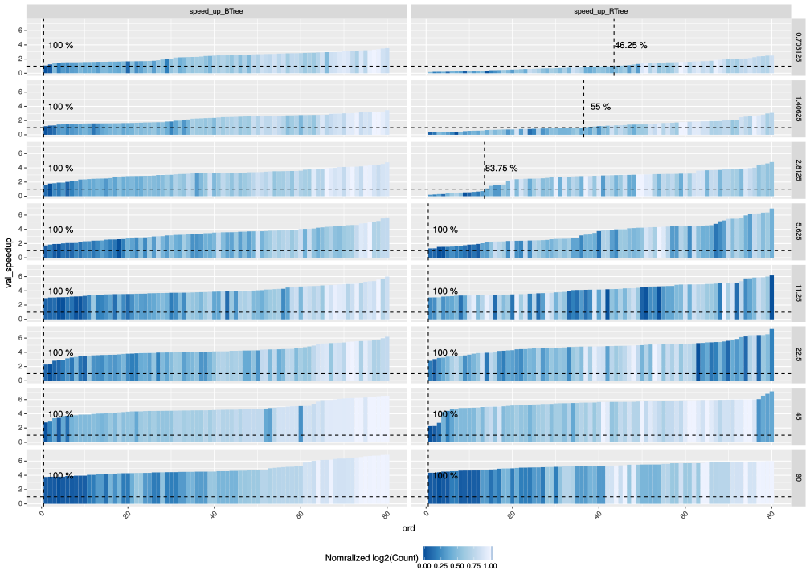

=======================================
Speedup comparison with BTree and RTree
=======================================

.. contents::

These results show the query's throughput speed-up for PMQ over BTree and RTree.

All the results were sorted by increasing speedUp value. 
The colors show the ratio between amount of false positive elements over the total amount of elements scanned by the query. 

.. image:: ./img/speedup_BTREE_RTREE.svg

We can see a correlation between the amount false positives and the Speedup over **RTrees** on small queries. 
This is due to the discontinuities caused by the Z-ordering scheme, used in the GeoHash algorithm. 
We can see that this correlation doesn't appear in the **BTree** speedups.

We normalized the element count within each querySize to check it the BTree's Speedup increases with the number os elements queried.

The color scale is normalized between the min and max count of the elements count in each facet.
Note that Count increases as power of 2 . Therefore we take the logarithm to map it to linear color scale. (see Extra sections on org file)

.. code:: R

    dfSpeedUp2 %>%
        mutate(Count = log2(Count)) %>%
        mutate(normCount = (Count - min(Count)) / ( max(Count) - min(Count))) %>%
        ggplot(aes(x = ord, y = val_speedup) ) +
        geom_bar(aes(fill=normCount), stat="identity",position="dodge",width=1) + 
        scale_fill_distiller(type="seq") +
        facet_grid(queryWidth~algo_speedup) +
        labs(fill="Normalized log2(Count)") + 
        theme(legend.position = "bottom",
              axis.text.x = element_text(angle = 45, hjust = 1)) +
        geom_hline(yintercept = 1, size = 0.5, linetype="dashed") +
        geom_vline(data=dfPct2, aes(xintercept = 80-PmqBest+0.5), size = 0.5 , linetype="dashed") +
        geom_text(data=dfPct2, aes(x=80-PmqBest + 4.5, y=4, label = paste(`%`,"%")))

