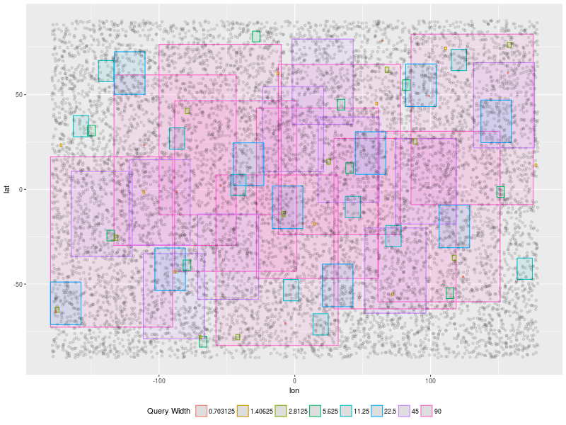

=======================================
Design of Experiments - Queries Dataset
=======================================

.. contents::

1 Random Data
-------------

1.1 Generate queries distributed on the whole coordinates grid
~~~~~~~~~~~~~~~~~~~~~~~~~~~~~~~~~~~~~~~~~~~~~~~~~~~~~~~~~~~~~~

- Use LHS design to choose centers of each query

- Avoid out-of-bound queries

.. code:: R

    library(DoE.wrapper)

Generates 8 sizes of width and height ( queries are square regions): 

.. code:: R

    dfwuni = data.frame( width = 180/(2**c(1:8)))
    dfwuni$height = dfwuni$width
    dfwuni$width

::

    [1] 90.000000 45.000000 22.500000 11.250000  5.625000  2.812500  1.406250
    [8]  0.703125

Compute the percentage of the whole are that each query represents 
and the expected amount of elements in each query, assuming *n* uniform data points.

.. code:: R

    n = 10**6 
    dfwuni$percent = ( dfwuni$width *  dfwuni$height) / (360*180) * 100
    dfwuni$expElts = round(( dfwuni$percent ) / 100 * n,2)
    dfwuni

.. table::

    +--------+--------+---------+-----------+
    |  width | height | percent |   expElts |
    +========+========+=========+===========+
    | 90.000 | 90.000 |  12.500 | 125000.00 |
    +--------+--------+---------+-----------+
    | 45.000 | 45.000 |   3.125 |  31250.00 |
    +--------+--------+---------+-----------+
    | 22.500 | 22.500 |   0.781 |   7812.50 |
    +--------+--------+---------+-----------+
    | 11.250 | 11.250 |   0.195 |   1953.12 |
    +--------+--------+---------+-----------+
    |  5.625 |  5.625 |   0.049 |    488.28 |
    +--------+--------+---------+-----------+
    |  2.812 |  2.812 |   0.012 |    122.07 |
    +--------+--------+---------+-----------+
    |  1.406 |  1.406 |   0.003 |     30.52 |
    +--------+--------+---------+-----------+
    |  0.703 |  0.703 |   0.001 |      7.63 |
    +--------+--------+---------+-----------+

Function: for a given width generates 10 position using LHS desing
Note: we limit latitude between -85.051132f and +85.051132f

.. code:: R

    latr = c(-85.051132,+85.051132)   # boundaries of latitude to generate the queries

    flhs = function(w){
        wq = w
        hq = wq # square queries

        d = lhs.design( type= "maximin" , nruns= 10 ,nfactors=2 , 
                       factor.names=list( 
                           lat=c(latr[1]+hq/2 , latr[2]-hq/2),
                           lon=c(-180+wq/2,180-wq/2)) 
                       )

        d$width = wq
        d$height = hq
        d
    }

Generates queries position for each value of Width.

.. code:: R

    set.seed(42);
    # dflist = mapply(flhs,dfwuni$width,dfwuni$height) 

    d8_llw = do.call( rbind, 
                     lapply(dfwuni$width,flhs) 
                     )
    head(d8_llw)

.. table::

    +-------------------+-------------------+-------+--------+
    |               lat |               lon | width | height |
    +===================+===================+=======+========+
    | -14.3493546448834 |  106.191921438323 |    90 |     90 |
    +-------------------+-------------------+-------+--------+
    |  15.4244144363771 | -88.1794538728427 |    90 |     90 |
    +-------------------+-------------------+-------+--------+
    | -37.3820934128109 |  -13.093290094519 |    90 |     90 |
    +-------------------+-------------------+-------+--------+
    | -2.05076308297226 |  16.7172994811553 |    90 |     90 |
    +-------------------+-------------------+-------+--------+
    |   21.036225209632 |   32.863257852383 |    90 |     90 |
    +-------------------+-------------------+-------+--------+
    |  1.73470416087192 | -43.4984842264094 |    90 |     90 |
    +-------------------+-------------------+-------+--------+

1.1.1 Visualization of queries with 10\*\*4 sample elements
^^^^^^^^^^^^^^^^^^^^^^^^^^^^^^^^^^^^^^^^^^^^^^^^^^^^^^^^^^^

.. code:: R

    library(tidyverse)

    set.seed(42);
    n = 10**4
    x <- runif(n,min=-179,max=179)
    y <- runif(n,min=-89,max=89)

    data.frame(lon = x, lat = y) %>% 
    ggplot(aes(x=lon,y=lat)) + 
    #geom_tile(data=d8_llw, aes(x=lon, y=lat, width=width,height=height) ,color="black", fill="blue", alpha=0.1) +
    geom_tile(data=d8_llw, aes(x=lon, y=lat, width=width,height=height, color=factor(width),fill=factor(width)), size=0.5, alpha=0.1)+
    geom_point(alpha=0.1)  +
    labs(color = "Query Width " ) + 
    theme(legend.position="bottom" ) +
    guides(color = guide_legend(nrow = 1), fill=FALSE)

1.2 Output Bounding Boxes to CSV
~~~~~~~~~~~~~~~~~~~~~~~~~~~~~~~~

Convert to columns to bounding box coordinates

.. code:: R

    d = d8_llw
    bbox = data.frame(lat0 = d$lat + d$width/2 ,
                      lon0 = d$lon - d$height/2 ,
                      lat1 = d$lat - d$width/2 ,
                      lon1 = d$lon + d$height/2)
    tail(bbox)

::

            lat0        lon0      lat1        lon1
    75 -17.88356    5.556157 -18.58669    6.259282
    76 -64.14098 -176.444238 -64.84411 -175.741113
    77 -70.30332   -7.324929 -71.00645   -6.621804
    78 -45.73760  123.537580 -46.44073  124.240705
    79  61.77395  156.651935  61.07082  157.355060
    80  23.76805 -111.183409  23.06492 -110.480284

Write the csv file of bounding boxes
`queriesLHS.csv <queriesLHS.csv>`_

.. _queries20170923145357:

2 Twitter Data
--------------

Description:

- Get n random position from the dataset of tweets. 
  `tweet10_6.dat <tweet10_6.dat>`_ or from geo-tweets.dat

- generate queries with 10 different widths

2.1 C++ : get random tweets from the dataset
~~~~~~~~~~~~~~~~~~~~~~~~~~~~~~~~~~~~~~~~~~~~

Use the following twitter dataset: 

`tweet10_4.dat <tweet10_4.dat>`_

.. code:: C++

    #include <GenericType.h>
    #include <input_it.h>

    #include <fstream>
    #include <unordered_set>

    using namespace std;

    int main(){
      using el_t = TweetDatType;
      using it_t = input_file_it<el_t>;

      std::unordered_set<int> offsets;

      std::shared_ptr < std::ifstream > file_ptr = std::make_shared<std::ifstream>(fname, std::ios::binary);

      auto begin = it_t::begin(file_ptr);
      auto end = it_t::end(file_ptr); 

      int itSize = end - begin;
  
      std::srand(42);

      int n = 80; // number of queries
      while(offsets.size() < n) 
        offsets.insert( std::rand() % itSize);

  
      cout << "id Latitude Longitude" << endl;
      for (auto& off : offsets){
        auto it = begin+off;
        printf("%d %.8f %.8f\n", off, (it)->getLatitude(), (it)->getLongitude()  );
        ++it;
      }

      return 0;
    }

2.2 Create bounding boxes for queries
~~~~~~~~~~~~~~~~~~~~~~~~~~~~~~~~~~~~~

.. code:: R

    #queries
    queries$width = rep(dfwuni$width/2 , each=10)
    names(queries) = c("tweet", "Lat", "Lon","width")
    head(queries)

.. table::

    +-------+-------------+---------------+-------+
    | tweet |         Lat |           Lon | width |
    +=======+=============+===============+=======+
    |  5230 | 40.73379898 |  -74.24279785 |    90 |
    +-------+-------------+---------------+-------+
    |  7278 | 39.90430069 |  -75.32160187 |    90 |
    +-------+-------------+---------------+-------+
    |  3773 | 47.75630188 | -122.15399933 |    90 |
    +-------+-------------+---------------+-------+
    |  8185 |  41.7521019 |  -87.65480042 |    90 |
    +-------+-------------+---------------+-------+
    |  1969 |  40.1169014 |  -75.02999878 |    90 |
    +-------+-------------+---------------+-------+
    |   320 | 40.91159821 |  -74.05319977 |    90 |
    +-------+-------------+---------------+-------+

2.2.1 Visualization of queries for the Twitter Dataset
^^^^^^^^^^^^^^^^^^^^^^^^^^^^^^^^^^^^^^^^^^^^^^^^^^^^^^

.. code:: R

    library(tidyverse)
    library(maps) 

    mapWorld <- borders("world", colour="gray50", fill="gray50") # create a layer of borders

    queries %>% filter( width <= 90 ) %>%
    ggplot(aes(x=Lon,y=Lat)) + 
    mapWorld + 
    #geom_tile(aes(width=width, height=width), color="black", fill=NA, alpha=0.1, size = 0.5) +
    geom_tile(aes(width=width, height=width, color=factor(width)),size=0.3,fill=NA) +
    xlim(-180,+180) + 
    ylim(-90,+90) +
    labs(color = "Query Width " ) + 
    theme(legend.position="bottom" ) +
    guides(color = guide_legend(nrow = 1))

2.3 Output Bounding Boxes to CSV
~~~~~~~~~~~~~~~~~~~~~~~~~~~~~~~~

Convert to columns to bounding box coordinates

.. code:: R

    d = queries
    queries_bbox = data.frame(lat0 = d$Lat + d$width/2 ,
                              lon0 = d$Lon - d$width/2 ,
                              lat1 = d$Lat - d$width/2 ,
                              lon1 = d$Lon + d$width/2)
    tail(queries_bbox)

::

           lat0       lon0     lat1       lon1
    75 33.38696 -117.22356 32.68384 -116.52044
    76 42.11816  -88.03276 41.41504  -87.32964
    77 40.50866  -89.71136 39.80554  -89.00824
    78 41.81486  -81.83406 41.11174  -81.13094
    79 33.15336 -117.58257 32.45024 -116.87944
    80 39.03126  -90.81466 38.32814  -90.11153

Write the csv file of bounding boxes

.. code:: R

    write.table(bbox,"queriesTwitter.csv",row.names=FALSE,col.names=FALSE,sep=",")

`queriesTwitter.csv <queriesTwitter.csv>`_
